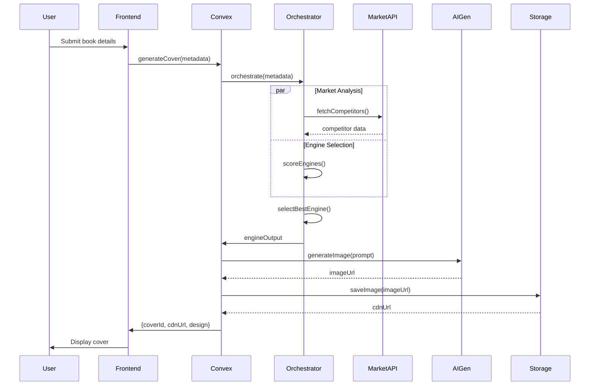

# Cover Generation Platform - Complete System Architecture

## 📚 Project Overview

A sophisticated book cover generation platform that uses multiple AI-driven engines to create market-aware, emotionally resonant book covers. The system analyzes market trends, genre conventions, and psychological design principles to generate covers that can either conform to successful patterns or differentiate in saturated markets.

## 🏗 Technology Stack

### Frontend
- **Framework**: Next.js 14 (App Router)
- **UI Components**: Custom React components with Tailwind CSS
- **State Management**: React Context API / Zustand
- **Real-time Features**: Liveblocks (for collaborative features)
- **Image Handling**: Canvas API for rendering
- **Type Safety**: TypeScript

### Backend Services
- **Database**: Convex (Real-time, serverless database)
- **Image Generation**:
  - Stable Diffusion API (via Replicate/Hugging Face)
  - DALL-E 3 API (via OpenAI)
  - Midjourney API (via unofficial wrapper)
- **Storage**:
  - Convex File Storage (for generated covers)
  - Cloudinary (for image optimization and CDN)
- **Authentication**: Clerk
- **Market Data APIs**:
  - Amazon Product Advertising API
  - Goodreads API
  - Google Books API
  - Custom web scraping services

## 🎯 Core Architecture

```
┌─────────────────────────────────────────────────────────────┐
│                        CLIENT LAYER                         │
├─────────────────────────────────────────────────────────────┤
│                                                             │
│  ┌──────────────┐  ┌──────────────┐  ┌──────────────┐    │
│  │   Next.js    │  │   Canvas     │  │  Liveblocks  │    │
│  │   Frontend   │  │   Renderer   │  │   Realtime   │    │
│  └──────┬───────┘  └──────┬───────┘  └──────┬───────┘    │
│         │                  │                  │            │
└─────────┴──────────────────┴──────────────────┴────────────┘
          │                                     │
          ▼                                     ▼
┌─────────────────────────────────────────────────────────────┐
│                      CONVEX BACKEND                         │
├─────────────────────────────────────────────────────────────┤
│                                                             │
│  ┌──────────────┐  ┌──────────────┐  ┌──────────────┐    │
│  │   Database   │  │   Functions  │  │     Auth     │    │
│  │   (Books)    │  │   (Actions)  │  │   (Clerk)   │    │
│  └──────────────┘  └──────┬───────┘  └──────────────┘    │
│                            │                                │
│  ┌──────────────────────────┴────────────────────────┐    │
│  │              CONVEX ACTIONS/MUTATIONS             │    │
│  ├───────────────────────────────────────────────────┤    │
│  │ • generateCover()    • analyzeMarket()           │    │
│  │ • selectEngine()     • fetchCompetitors()        │    │
│  │ • saveCoverDesign()  • calculateSimilarity()    │    │
│  └───────────────────────────────────────────────────┘    │
│                                                             │
└─────────────────────────────────────────────────────────────┘
          │                                     │
          ▼                                     ▼
┌─────────────────────────────────────────────────────────────┐
│                    ENGINE ORCHESTRATION                     │
├─────────────────────────────────────────────────────────────┤
│                                                             │
│  ┌──────────────┐  ┌──────────────┐  ┌──────────────┐    │
│  │   Semiotic   │  │  Affective   │  │   Market     │    │
│  │    Engine    │  │   Engine     │  │Intelligence  │    │
│  └──────────────┘  └──────────────┘  └──────┬───────┘    │
│                                               │             │
└───────────────────────────────────────────────┼─────────────┘
                                                │
          ┌─────────────────────────────────────┴─────┐
          ▼                                           ▼
┌──────────────────┐                      ┌──────────────────┐
│  EXTERNAL APIs   │                      │  AI GENERATION   │
├──────────────────┤                      ├──────────────────┤
│ • Amazon Books   │                      │ • Stable Diff    │
│ • Goodreads      │                      │ • DALL-E 3       │
│ • Google Books   │                      │ • Midjourney     │
│ • Design Awards  │                      │ • GPT-4 Vision   │
└──────────────────┘                      └──────────────────┘
```

## 🔧 Engine System Architecture

### Engine Types & Capabilities

```typescript
// lib/engines/base-engine.ts
interface Engine {
  name: string
  analyze(metadata: BookMetadata, marketInsight: MarketInsight): EngineOutput
  calculateSuitability(metadata: BookMetadata): number
}
```

### Available Engines

1. **Semiotic Engine** (`lib/engines/semiotic-engine.ts`)
   - Decodes genre conventions
   - Maps tropes to visual elements
   - Analyzes market saturation

2. **Affective Composition Engine** (`lib/engines/affective-engine.ts`)
   - Emotion-driven design
   - Psychological color mapping
   - Mood-based composition

3. **Market Intelligence System** (`lib/engines/market-intelligence.ts`)
   - Competitor analysis
   - Trend identification
   - Gap detection

## 📡 API Endpoints & Data Flow

### Convex Functions Structure

```typescript
// convex/covers.ts
export const generateCover = action({
  args: {
    title: v.string(),
    author: v.optional(v.string()),
    synopsis: v.optional(v.string()),
    genre: v.optional(v.string()),
    strategy: v.optional(v.union(
      v.literal("conform"),
      v.literal("differentiate"),
      v.literal("hybrid"),
      v.literal("auto")
    ))
  },
  handler: async (ctx, args) => {
    // 1. Authenticate user
    const identity = await ctx.auth.getUserIdentity()

    // 2. Initialize engine orchestrator
    const orchestrator = new EngineOrchestrator()

    // 3. Fetch market data
    const marketData = await fetchMarketData(args.genre)

    // 4. Generate cover design
    const result = await orchestrator.orchestrate({
      title: args.title,
      author: args.author,
      synopsis: args.synopsis,
      genre: args.genre
    })

    // 5. Generate visual with AI
    const imageUrl = await generateImage(result.coverDesign.visualPrompt)

    // 6. Store in database
    const coverId = await ctx.db.insert("covers", {
      userId: identity.subject,
      title: args.title,
      design: result.coverDesign,
      imageUrl,
      engineUsed: result.engineUsed,
      createdAt: Date.now()
    })

    return { coverId, imageUrl, design: result.coverDesign }
  }
})
```

### Market Intelligence API Flow

```typescript
// convex/market.ts
export const analyzeMarket = action({
  args: {
    genre: v.string(),
    subgenre: v.optional(v.string())
  },
  handler: async (ctx, args) => {
    // Parallel API calls for speed
    const [amazonData, goodreadsData, trendsData] = await Promise.all([
      fetchAmazonBestsellers(args.genre),
      fetchGoodreadsTopRated(args.genre),
      fetchDesignTrends(args.genre)
    ])

    // Process and analyze
    const analysis = processMarketData(amazonData, goodreadsData, trendsData)

    // Cache results for 24 hours
    await ctx.db.insert("marketCache", {
      genre: args.genre,
      data: analysis,
      timestamp: Date.now(),
      expiresAt: Date.now() + 86400000 // 24 hours
    })

    return analysis
  }
})
```

## 🎨 Image Generation Pipeline

### Step 1: Design Specification
```typescript
const designSpec = {
  visualPrompt: "Dark thriller book cover: noir cityscape...",
  colorPalette: ["#000000", "#dc143c", "#ffffff"],
  typography: {
    title: { family: "Impact", size: "48px", weight: "bold" },
    author: { family: "Arial", size: "18px", weight: "normal" }
  },
  layout: {
    template: "rule-of-thirds",
    titlePosition: { x: "33%", y: "33%" }
  }
}
```

### Step 2: AI Image Generation
```typescript
async function generateImage(spec: DesignSpec) {
  // Try multiple providers for best results
  const providers = [
    { name: 'stable-diffusion', weight: 0.4 },
    { name: 'dalle3', weight: 0.4 },
    { name: 'midjourney', weight: 0.2 }
  ]

  // Generate with primary provider
  const primaryImage = await generateWithProvider(
    providers[0],
    spec.visualPrompt
  )

  // Apply post-processing
  const processedImage = await applyDesignElements(primaryImage, {
    text: spec.typography,
    colors: spec.colorPalette,
    layout: spec.layout
  })

  return processedImage
}
```

### Step 3: Canvas Rendering
```typescript
// components/CoverRenderer.tsx
export function CoverRenderer({ design, imageUrl }) {
  const canvasRef = useRef<HTMLCanvasElement>(null)

  useEffect(() => {
    const ctx = canvasRef.current?.getContext('2d')
    if (!ctx) return

    // Load background image
    const img = new Image()
    img.src = imageUrl
    img.onload = () => {
      // Draw image
      ctx.drawImage(img, 0, 0, 600, 900)

      // Apply color overlay if needed
      applyColorCorrection(ctx, design.colorPalette)

      // Render typography
      renderText(ctx, design.typography, design.layout)

      // Add effects
      applyEffects(ctx, design.effects)
    }
  }, [design, imageUrl])

  return <canvas ref={canvasRef} width={600} height={900} />
}
```

## 🗄 Database Schema (Convex)

```typescript
// convex/schema.ts
export default defineSchema({
  covers: defineTable({
    userId: v.string(),
    title: v.string(),
    author: v.optional(v.string()),
    genre: v.optional(v.string()),
    design: v.object({
      visualPrompt: v.string(),
      colorPalette: v.array(v.string()),
      typography: v.any(),
      layout: v.any(),
      mood: v.string(),
      reasoning: v.array(v.string())
    }),
    imageUrl: v.string(),
    engineUsed: v.string(),
    marketPosition: v.string(),
    confidence: v.number(),
    versions: v.array(v.string()), // Alternative versions
    createdAt: v.number(),
    updatedAt: v.optional(v.number())
  }).index("by_user", ["userId"]),

  marketCache: defineTable({
    genre: v.string(),
    subgenre: v.optional(v.string()),
    data: v.object({
      topCompetitors: v.array(v.any()),
      saturatedElements: v.array(v.string()),
      opportunities: v.array(v.string()),
      trendingStyles: v.array(v.string())
    }),
    timestamp: v.number(),
    expiresAt: v.number()
  }).index("by_genre", ["genre"]),

  engineMetrics: defineTable({
    engineName: v.string(),
    usageCount: v.number(),
    successRate: v.number(),
    averageConfidence: v.number(),
    userRatings: v.array(v.number())
  })
})
```

## 🚀 Deployment Architecture

### Backend Services Hosting

```yaml
# Infrastructure Setup
services:
  convex:
    provider: Convex Cloud
    region: us-west-2
    plan: Production
    features:
      - Real-time subscriptions
      - Automatic scaling
      - Built-in auth integration

  image-generation:
    replicate:
      models:
        - stability-ai/sdxl
        - stability-ai/stable-diffusion
      api-key: ${REPLICATE_API_KEY}

    openai:
      model: dall-e-3
      api-key: ${OPENAI_API_KEY}

    midjourney:
      webhook-url: ${MIDJOURNEY_WEBHOOK}
      api-key: ${MIDJOURNEY_API_KEY}

  storage:
    cloudinary:
      cloud-name: ${CLOUDINARY_CLOUD_NAME}
      api-key: ${CLOUDINARY_API_KEY}
      folders:
        - /covers/generated
        - /covers/templates
        - /covers/user-uploads

  external-apis:
    amazon:
      endpoint: https://webservices.amazon.com/paapi5
      credentials: ${AMAZON_ACCESS_KEY}

    goodreads:
      endpoint: https://www.goodreads.com/api
      key: ${GOODREADS_API_KEY}
```

### Environment Variables

```bash
# .env.local
# Convex
CONVEX_DEPLOYMENT=your-deployment-name
NEXT_PUBLIC_CONVEX_URL=https://your-deployment.convex.cloud

# Authentication
NEXT_PUBLIC_CLERK_PUBLISHABLE_KEY=pk_test_xxx
CLERK_SECRET_KEY=sk_test_xxx

# AI Generation
REPLICATE_API_KEY=r8_xxx
OPENAI_API_KEY=sk-xxx
MIDJOURNEY_API_KEY=mj_xxx

# Storage
CLOUDINARY_CLOUD_NAME=your-cloud
CLOUDINARY_API_KEY=xxx
CLOUDINARY_API_SECRET=xxx

# Market APIs
AMAZON_ACCESS_KEY=xxx
AMAZON_SECRET_KEY=xxx
GOODREADS_API_KEY=xxx
GOOGLE_BOOKS_API_KEY=xxx

# Analytics
NEXT_PUBLIC_POSTHOG_KEY=xxx
NEXT_PUBLIC_MIXPANEL_TOKEN=xxx
```

## 📊 Request/Response Flow

### Complete Generation Flow



### Response Structure

```typescript
interface GenerationResponse {
  success: boolean
  data: {
    coverId: string
    imageUrl: string
    design: {
      visualPrompt: string
      colorPalette: string[]
      typography: TypographySpec
      layout: LayoutSpec
      mood: string
      reasoning: string[]
    }
    engine: {
      name: string
      confidence: number
      strategy: 'conform' | 'differentiate' | 'hybrid'
    }
    market: {
      position: string
      competitors: number
      saturation: number
      opportunities: string[]
    }
    alternatives: CoverDesign[]
  }
  metadata: {
    generationTime: number
    creditsUsed: number
    timestamp: string
  }
}
```

## 🔒 Security & Rate Limiting

```typescript
// convex/middleware/rateLimiter.ts
export const rateLimiter = {
  generation: {
    windowMs: 60000, // 1 minute
    maxRequests: 5,
    message: "Too many generation requests"
  },
  marketAnalysis: {
    windowMs: 300000, // 5 minutes
    maxRequests: 10,
    message: "Too many market analysis requests"
  }
}

// convex/middleware/auth.ts
export const requireAuth = async (ctx: ActionCtx) => {
  const identity = await ctx.auth.getUserIdentity()
  if (!identity) {
    throw new ConvexError("Authentication required")
  }
  return identity
}
```

## 🎯 Performance Optimizations

### Caching Strategy
```typescript
// Market data: 24 hours
// Generated images: Permanent (CDN)
// Engine scores: 1 hour
// User preferences: Session

const cacheConfig = {
  market: { ttl: 86400000, storage: 'convex' },
  images: { ttl: null, storage: 'cloudinary' },
  scores: { ttl: 3600000, storage: 'memory' },
  prefs: { ttl: 'session', storage: 'localStorage' }
}
```

### Parallel Processing
```typescript
// Execute independent operations concurrently
const [market, images, analysis] = await Promise.all([
  fetchMarketData(genre),
  preloadImageAssets(theme),
  analyzeCompetitors(genre)
])
```

## 📈 Monitoring & Analytics

```typescript
// Track engine performance
interface EngineMetrics {
  engineName: string
  requestId: string
  userId: string
  executionTime: number
  confidence: number
  selected: boolean
  userRating?: number
}

// Log to analytics
analytics.track('cover_generated', {
  engine: result.engineUsed,
  genre: metadata.genre,
  strategy: result.marketPosition,
  confidence: result.confidence,
  alternatives: result.alternatives.length
})
```

## 🚦 Development Commands

```bash
# Development
npm run dev           # Start Next.js dev server
npx convex dev       # Start Convex dev server

# Testing
npm run test         # Run unit tests
npm run test:e2e     # Run end-to-end tests
npm run test:engines # Test engine logic

# Deployment
npx convex deploy    # Deploy Convex functions
npm run build        # Build Next.js app
vercel --prod        # Deploy to Vercel

# Utilities
npm run analyze      # Analyze bundle size
npm run lint         # Run ESLint
npm run type-check   # Run TypeScript checks
```

## 📝 Notes & Best Practices

1. **Engine Selection**: Always run market analysis before engine selection
2. **Caching**: Cache expensive market API calls aggressively
3. **Fallbacks**: Have fallback engines if primary fails
4. **Credits**: Track AI generation credits per user
5. **Versioning**: Keep multiple versions for A/B testing
6. **Monitoring**: Log all engine decisions for ML training

## 🔄 Future Enhancements

- [ ] Implement remaining engines (Typography, Abstract, etc.)
- [ ] Add ML-based engine selection
- [ ] Real-time collaboration on covers
- [ ] Version control for designs
- [ ] Export templates for print
- [ ] Integration with print-on-demand services
- [ ] Advanced analytics dashboard
- [ ] Custom training on successful covers